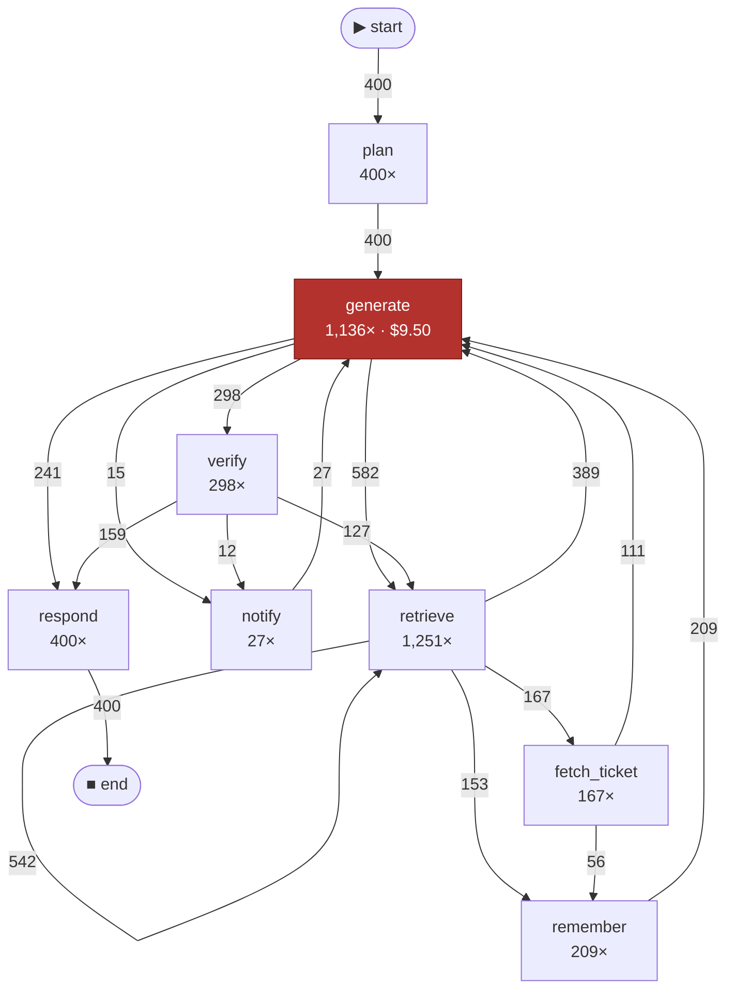

# traceroutine

Process mining for LLM agent traces — where the tokens and the time actually go.

Observability platforms attribute spend by **who**: per user, per team, per API key.
`traceroutine` attributes it by **how** — per execution path.

> An agent's cost is a property of its trajectory, not of its request.


## Three commands, zero instrumentation

If you use Claude Code, the data is already on your disk. No exporter, no collector,
no account anywhere:

```console
$ traceroutine ingest ~/.claude/projects -o events.parquet --case task
claude-code: 13,212 events -> events.parquet  (case=task, flatten=genai)

$ traceroutine abstract events.parquet --backend none
21 raw labels -> 18 canonical (rules removed 3) -> 18 activities -> activity_map.yaml

$ traceroutine report events.parquet -f md
vocabulary activity_map.yaml: 18 activities (none:-)
456 cases · 322 paths · $775.91 · rework 89.1% -> report.md
  1. Results of `tool:Bash` carry 12% of the budget through context (up to $93.65)
  2. Loop `chat → tool:Edit` runs an extra time (up to $51.33)
  3. Working rhythm `chat → tool:Bash` — 39% of the budget
```

That is my own history: 456 tasks. The dollars are API list prices rather than an
invoice — I pay a $20 subscription, so this is what those tokens would have cost, not
what I was billed. Worth a moment on its own: a flat fee hides a month that prices out
at $776. The first finding is the whole thesis:

> **Results of `tool:Bash` carry 12% of the budget through context.**
> The step itself burns no tokens and shows as **$0.00** in every cost breakdown. But
> each of its results adds ~1,400 tokens to the prompt, and those are re-read on
> **every** subsequent turn: 110M tokens carried in total. Fix by truncating output,
> not by switching models.

A tool call costs nothing when it happens and keeps costing for the rest of the run.
That is why the unit of cost is the path, not the request.

Context re-reading is a known phenomenon — vendors document it. What is missing
everywhere else is the **attribution**: not "context grows", but *which* step's results
carried *how many* dollars across the rest of the trajectory.

## Does it read my code?

A fair question: you are pointing a tool at your entire working history.

**Nothing leaves your machine.** `ingest`, `report`, `check` and `diff` make no network
calls at all. There is no telemetry, no config in your home directory, no account.

**What the event log holds:** activity names (`tool:Bash`, `chat`), timestamps, token
counters, cost, opaque IDs, and the *basename* of the project directory. No message
text, no tool arguments, no file paths, no commands. That is enforced in the adapter
rather than in the report — because reports get shared — and it is tested:
`test_no_message_content_leaks_into_spans`, `test_project_name_is_basename_only`.

**The one command that can talk to a cloud is `abstract`**, whose default backend is
`anthropic`. It sends the list of **distinct activity names** — a few dozen short
strings — and nothing else: no events, no counters, no content. To see that list before
trusting anyone with it, build the vocabulary offline first:

```bash
traceroutine abstract events.parquet --backend none    # no network, ever
```

The `mapping:` keys in the resulting `activity_map.yaml` are exactly the strings a cloud
backend would have received. Read them, then decide. `--backend ollama` keeps the step
on your own machine permanently.

## Install

```bash
uvx traceroutine --help          # no install
pip install traceroutine         # or into your environment
```

## Or on the demo dataset

Synthetic traces with deliberately planted pathologies — a retrieval loop, an escalation
to an expensive model, a long tail of rare paths:

```bash
git clone https://github.com/gurov/traceroutine && cd traceroutine
uv pip install -e .
python examples/gen_otlp.py examples/traces.json

traceroutine ingest examples/traces.json -o events.parquet
traceroutine report events.parquet -f html -m examples/activity_map.yaml
traceroutine check events.parquet -p examples/process.yaml -m examples/activity_map.yaml
```

The last command exits 1 and reports that in 60% of runs the agent answers without
verifying — which is in the declared process and not in the log.

## What it does

| | |
|---|---|
| `ingest <src>` | traces → a canonical event log (parquet) |
| `abstract <log>` | raw span labels → `activity_map.yaml`, a semantic vocabulary |
| `report <log>` | findings + process graph: `-f html` or `-f md` |
| `check <log>` | conformance against a declared `process.yaml`; exit codes for CI |
| `diff <a> <b>` | compare two logs: a prompt release, a model swap, two cohorts |

`report`, `check` and `diff` pick up `./activity_map.yaml` when it is there, and say so.

And this is the process graph of the demo dataset — GitHub renders it straight out
of `report -f md`, no image involved:



_Steps shown without a figure spend no tokens at the moment of the call. That is not
the same as free: their results stay in the prompt and are re-read on every later
turn — see context inflation above._

`retrieve → retrieve` 542 times is the retrieval loop: a shape you can see in a
graph and cannot see in a list of traces.

### Sources

Three adapters, three genuinely different data models — which is most of the work:

- **OpenTelemetry / OTLP** — GenAI semantic conventions, plus OpenInference aliases.
  A tree of spans.
- **Claude Code transcripts** — `~/.claude/projects/**/*.jsonl`. Zero instrumentation.
  One model response is written as *several* records sharing a `requestId`, with `usage`
  repeated in each; miss that and cost is overstated 2.1×.
- **Chat transcripts** — the OpenAI-style `messages` format public agent corpora ship in.
  Often no timestamps and no token counts at all.

### Case notion — the decision that determines everything

`--case trace | session | task | attr:<name>` produces different processes from the same
data, and the difference is not cosmetic. On real Claude Code transcripts, taking a
*session* as the case gives 61 cases and 61 unique paths: variant analysis degenerates
completely, because no two working days are alike. A *task* — one user request and all
the work under it — is the unit that actually repeats.

### The abstraction layer

Two levels. **Rules** strip call arguments, IDs and retry counters — free, offline,
reproducible. An **LLM** does what a regex cannot: decide that `validate_answer`,
`self_critique` and `check_citations` are one step called *verify*. It runs over the set
of **distinct** labels, not over events: two million events have 300–500 distinct shapes,
so this is one request rather than two million.

A model is a **resource**, not an activity: `chat:claude-opus-5` and `chat:claude-sonnet-5`
collapse into `chat`, and the price difference shows up in the per-resource breakdown.

`activity_map.yaml` is a versioned project artifact. Its `overrides` section is
hand-edited, wins over `mapping`, and survives regeneration.

Two quality checks, because one is not enough. `--stability N` reports the Rand index
across runs: if the vocabulary drifts, the reports cannot be trusted. And an automatic
merge audit, because the activity counter misses the failure that matters — where the
model hits the target count by merging a **paid** step with a **free** one. Target met,
cost attribution destroyed.

## Conformance — the declared process

The finding that shaped the tool: **a process mining result is only meaningful relative
to an expectation.** An open-ended agent has no declared happy path, so every result
decays into a description of the norm — "the agent calls Bash a lot" is true and useless.
`process.yaml` is that missing expectation.

```yaml
name: coding-agent
flow: |
  chat -> (tool:Read | tool:Grep)+ -> (chat | tool:Edit | tool:Bash)* -> chat
rules:
  - last: chat                                 # don't end on a tool call
  - {before: tool:Edit, expect: tool:Read}     # never edit a file you have not read
  - {after: tool:Edit, expect: tool:Bash}      # after editing, run something
  - {max: 40, of: tool:Bash}
thresholds:
  fitness_min: 0.95
  usd_per_case_max: 2.00
```

Run it against the same log as above:

```console
$ traceroutine check events.parquet -p process.yaml
vocabulary activity_map.yaml
VIOLATED: coding-agent · 456 runs · fitness 0.899 · $1.7015/run
  ✗ fitness 0.899 < 0.950
  ✗ run length p95 111 > 60
  ✗ a run ends with `chat`: violated in 42 runs (9.2%)
  ✗ before `tool:Edit`, `tool:Read` must have happened: violated in 93 runs (20.4%)
  ✗ after `tool:Edit`, `tool:Bash` must eventually follow: violated in 54 runs (11.8%)
  ✗ `tool:Bash` at most 40× per run: violated in 16 runs (3.5%)
  ! declared but never seen in the log: tool:Glob, tool:Grep. Check the activity names…
  off-model: $1.05 (0.1% of budget)
```

**21% of tasks edit a file without reading it first, 12% run no check after an edit, and
9.2% end on a tool call rather than an answer.** No unit test sees any of that.

Two notations, and both are needed. The **imperative** one (`flow`) yields fitness — a
single "how far from the design" number, from aligning each trace against the model's
language. The **declarative** one (`rules`) answers which specific promise was broken and
where. For agents the declarative half matters more, and not as a matter of taste: an
agent is non-deterministic by construction, so a rigid sequence scores near-zero fitness
and tells you nothing. What you actually expect reads as *"whatever else you do, don't
answer without checking"* — that is the DECLARE vocabulary, and it fits agents better
than Petri nets.

Rule forms: `always`, `never`, `first`, `last`, `{after: A, expect: B}`,
`{before: A, expect: B}`, `{after: A, forbid: B}`, `{max: N, of: X}`, plus `allow:`
(tolerated share of offending runs) and `warn:` (reported, does not fail the build).

Money is attributed **narrowly**. `never`, `forbid` and `max` are broken by an extra
step, whose cost is known by name. `after`, `always`, `first`, `last` are broken by
something that did *not* happen — those get no dollar figure at all, rather than a
plausible invented one.

### In CI

Exit codes: `0` fine, `1` thresholds violated, `2` broken `process.yaml`. A broken config
and a failed check need different reactions, and CI only sees the code. A model written
against activities the log does not contain is a broken config, not a violation:

```console
$ traceroutine check events.parquet -p process.yaml     # log never abstracted
process.yaml: process.yaml and the log are at different abstraction levels:
  `chat` — the log has `chat:claude-opus-4-8`, `chat:claude-opus-5`
Nothing is compared against those names, so fitness and the deviation map would both be
fiction. Build the vocabulary and pass it in: …
```

`action.yml` is a ready composite action. `check` writes its own summary — with a mermaid
deviation graph — to `$GITHUB_STEP_SUMMARY`, and its metrics to `$GITHUB_OUTPUT`.

```yaml
- uses: gurov/traceroutine@v1
  with: {traces: traces/, process: process.yaml, case: session}
```

A complete workflow to copy is in [`examples/workflow.yml`](examples/workflow.yml).

With `--baseline` you also get "no worse than before" thresholds: cost per run, run
length, fitness drop. Absolute thresholds need re-tuning after every release; relative
ones do not.

## What gets computed

- variants (equivalence classes of paths) and the cost of each
- Pareto concentration over per-run cost
- a directly-follows graph weighted by frequency and by money
- rework rate, and the price of each cycle
- separate accounting for cached and cache-written tokens — cache *writes* cost 1.25–2×
  input, so ignoring them undercounts, and folding cache reads into input overcounts by 10×
- **context inflation** — what a step that shows $0.00 actually costs on the rest of the run
- fitness and a deviation map against a declared process

## When this will not help you

Stated up front, because a tool that always returns five findings eventually returns five
invented ones.

**Variant analysis has a measured limit.** Path uniqueness climbs from 17% at 1–3 steps
to 100% at 26+. Above roughly 13 steps trajectories stop repeating, and "rare paths eat
the budget" becomes the tautology "expensive runs are expensive". So the variant lens
fits short structured agents — RAG, support, routing — and not long ones. When repeated
paths drop below 50%, `traceroutine` says so and suppresses those findings instead of
dressing up a tautology. Abstraction helps but does not rescue it: on synthetic data a
vocabulary lifts reuse from 11% to 78%, on real coding traces only from 32% to 37%.
Length is the binding constraint, not granularity.

What still works on long runs: context inflation, cohort `diff`, and conformance — all
three get *stronger* with trace length rather than degenerating.

## Architecture

```
Ingest → Normalize → Abstract → Mine → Analyze → Conform → Render
```

Adapters are the extension point: a two-method contract (`detect`, `read`), see
`adapters/base.py`.

Alignments are implemented here rather than via pm4py, deliberately. pm4py pulls in
pandas + scipy + networkx, and `uvx traceroutine` has to install in seconds; the model
language here is a regular expression over activities rather than an arbitrary Petri net,
so alignment is exact and fits in a 0-1 BFS; all of pm4py's hard algorithmics exist for
unbounded nets, which we do not have. The fitness formula is theirs:
`1 − cost / (|trace| + |shortest model run|)`.

Built on public literature: van der Aalst, *Process Mining: Data Science in Action*;
Leemans, inductive miner; Adriansyah, alignments; Pesic & van der Aalst, DECLARE;
OpenTelemetry GenAI semantic conventions; XES / OCEL 2.0.

## Status

Alpha, and honest about it: it runs end to end on three sources, it has been validated
against real data twice, and it has 149 tests. The interactive graph renderer is not
built yet — the graph above is a static sketch.

## License

Apache-2.0
