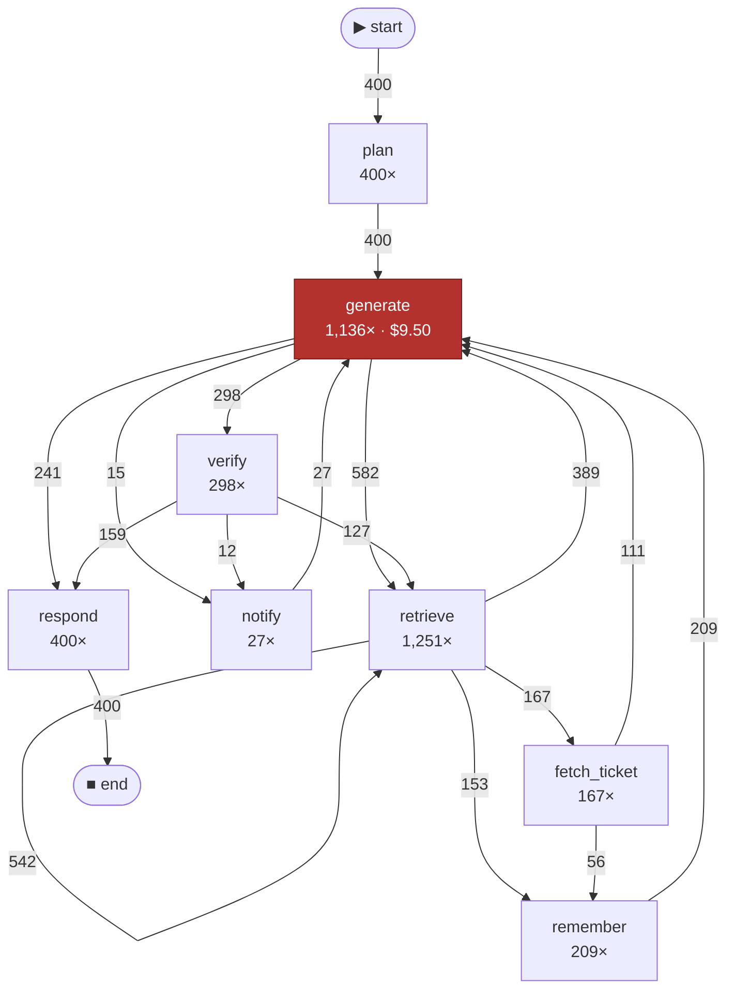

# Guide

The pipeline is `Ingest → Normalize → Abstract → Mine → Analyze → Conform → Render`.
`traceroutine` with no arguments runs the first five with sensible defaults; every stage
is also a command when the defaults are not what you want.

## Sources

Three adapters, three genuinely different data models — which is most of the work:

- **OpenTelemetry / OTLP** — GenAI semantic conventions, plus OpenInference aliases.
  A tree of spans.
- **Claude Code transcripts** — `~/.claude/projects/**/*.jsonl`. Zero instrumentation.
  One model response is written as *several* records sharing a `requestId`, with `usage`
  repeated in each; miss that and cost is overstated 2.1×.
- **Chat transcripts** — the OpenAI-style `messages` format public agent corpora ship in.
  Often no timestamps and no token counts at all.

The format is detected from the file; `--adapter` overrides. Adapters are the extension
point: a two-method contract (`detect`, `read`), see `src/traceroutine/adapters/base.py`.

## The case notion decides everything

`--case trace | session | task | attr:<name>` produces different processes from the same
data, and the difference is not cosmetic. On real Claude Code transcripts, taking a
*session* as the case gives 61 cases and 61 unique paths: variant analysis degenerates
completely, because no two working days are alike. A *task* — one user request and all
the work under it — is the unit that actually repeats, and it is what the one-shot picks
for Claude Code.

## The abstraction layer

Two levels. **Rules** strip call arguments, IDs and retry counters — free, offline,
reproducible, and all the one-shot uses. An **LLM** does what a regex cannot: decide that
`validate_answer`, `self_critique` and `check_citations` are one step called *verify*. It
runs over the set of **distinct** labels, not over events: two million events have
300–500 distinct shapes, so this is one request rather than two million.

```bash
traceroutine abstract events.parquet --backend anthropic   # or gemini, ollama, none
```

A model is a **resource**, not an activity: `chat:claude-opus-5` and
`chat:claude-sonnet-5` collapse into `chat`, and the price difference shows up in the
per-resource breakdown instead.

`activity_map.yaml` is a versioned project artifact. Its `overrides` section is
hand-edited, wins over `mapping`, and survives regeneration.

Two quality checks, because one is not enough. `--stability N` reports the Rand index
across runs: if the vocabulary drifts, the reports cannot be trusted. And an automatic
merge audit, because the activity counter misses the failure that matters — where the
model hits the target count by merging a **paid** step with a **free** one. Target met,
cost attribution destroyed.

## What gets computed

- variants (equivalence classes of paths) and the cost of each
- Pareto concentration over per-run cost
- a directly-follows graph weighted by frequency and by money
- rework rate, and the price of each cycle
- separate accounting for cached and cache-written tokens — cache *writes* cost 1.25–2×
  input, so ignoring them undercounts, and folding cache reads into input overcounts by 10×
- **context inflation** — what a step that shows $0.00 actually costs on the rest of the run
- fitness and a deviation map against a declared process

### Money

Every dollar figure is computed from token counts at API list prices
(`src/traceroutine/pricing.yaml`, override with `--pricing`). Transcripts carry no
billing data at all. On a subscription plan the figure is what the tokens would have
cost, not what you were charged — useful as a common ruler that makes trajectories
comparable, not as an invoice.

## The process graph

`report -f md` emits mermaid, which GitHub renders directly:



_Steps shown without a figure spend no tokens at the moment of the call. That is not the same as free: their results stay in the prompt and are re-read on every later turn — see context inflation above._

`retrieve → retrieve` 542 times is the retrieval loop: a shape you can see in a graph and
cannot see in a list of traces.

The HTML report draws the same graph as an inline SVG, in a single self-contained file
with no external requests. It is a readable sketch rather than a real renderer — proper
layout is the interactive graph, which is not built yet.

## Comparing two logs

```bash
traceroutine diff before.parquet after.parquet
```

What changed in behaviour after a prompt release or a model swap: new paths, longer runs,
cost per task. It also works on two cohorts of the same log — on public corpora with
outcome labels it produced a portrait of success in minutes (failed runs read more and
search less, verify themselves less often, and give up earlier).

## Architecture

Each layer is a module with a narrow contract, and the pipeline can be re-entered at any
stage — the event log is a parquet file, not a private format.

Alignments are implemented here rather than via pm4py, deliberately. pm4py pulls in
pandas + scipy + networkx, and `uvx traceroutine` has to install in seconds; the model
language here is a regular expression over activities rather than an arbitrary Petri net,
so alignment is exact and fits in a 0-1 BFS; all of pm4py's hard algorithmics exist for
unbounded nets, which we do not have. The fitness formula is theirs:
`1 − cost / (|trace| + |shortest model run|)`.

Built on public literature: van der Aalst, *Process Mining: Data Science in Action*;
Leemans, inductive miner; Adriansyah, alignments; Pesic & van der Aalst, DECLARE;
OpenTelemetry GenAI semantic conventions; XES / OCEL 2.0.
